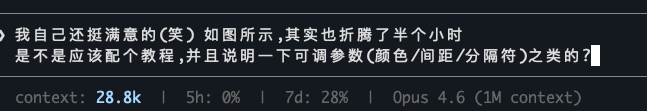

# Claude Code Sharing

Configs, skills, and presets for Claude Code.

## Status Line

Pre-designed status line with interactive setup — pick layout, colors, separator from curated options.



**Quick start:** paste this link to Claude Code and say "set up my status line using this link":

```
https://raw.githubusercontent.com/kirisawa-subaru/claude-code-sharing/main/statusline/skill/statusline-setup.md
```

[Details →](./statusline/)

## License

MIT
