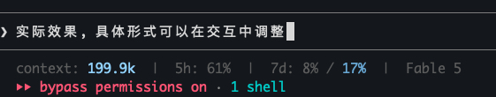
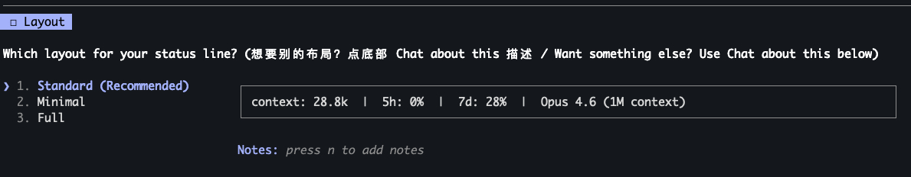
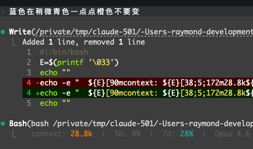

# Claude Code Status Line

方便的设置claude code statusline

### 预览:  


```
context: 28.8k  |  5h: 0%  |  7d: 28%  |  Opus 4.6 (1M context)
```

### 设置过程: 
<br>


### 使用方式

打开**新的 Claude Code session** (Sonnet or Opus), 粘贴链接并告诉claude **"请按照该链接设置 statusline"** or **"Set up my status line using this link"**:

```
https://raw.githubusercontent.com/kirisawa-subaru/claude-code-sharing/main/statusline/skill/statusline-setup.md
```
然后交给claude, 通过交互式的操作进行设置就好. 

## Why not the built-in `/statusline`?

The official command generates a status line with no layout constraints — font weight, spacing, information density are all uncontrolled. The result usually looks like an afterthought.

This one gives you pre-designed presets with curated typography, and lets you customize through selection rather than free-form prompting.

#
### Alternative: install as a slash command

If you prefer a reusable `/statusline-setup` command:

```bash
mkdir -p ~/.claude/agents && curl -sL https://raw.githubusercontent.com/kirisawa-subaru/claude-code-sharing/main/statusline/skill/statusline-setup.md -o ~/.claude/agents/statusline-setup.md
```

The skill self-deletes after writing your config. Re-run the command above to reconfigure.

## What's configurable

| Step | Options |
|------|---------|
| **Layout** | Minimal (labels stripped), Standard (labeled), Full (+ timestamps + cost), or design your own |
| **Colors** | Moonlight (blue), Mono (gray), Clean (white), or create your own with live terminal preview |
| **Separator** | Pipe `\|`, dot `·`, slim, or any character you like |
| **Precision** | Whole numbers (`29k`) or one decimal (`28.8k`) |
| **Per-model usage** | Optional second number on the `7d` segment — see below |

Every option comes with a visual preview. Colors get a live ANSI preview in your terminal.

## Per-model weekly usage (optional)

```
context: 64.3k  |  5h: 65%  |  7d: 9% / 17%  |  Opus 5
                                       ^^^^
                                       one model's weekly quota
```

Claude Code's status line only receives two rate-limit buckets, `five_hour` and `seven_day`. The per-model bars in `/usage` come from a different source — the usage endpoint's `limits[]` array — and the status line projection drops them. So this number has to be fetched out of band.

[`bin/usage-poll.py`](./bin/usage-poll.py) does that. It reads the OAuth token Claude Code already stores (env var, `~/.claude/.credentials.json`, or macOS Keychain), makes one request to `https://api.anthropic.com/api/oauth/usage`, and writes a small cache to `~/.claude/usage-cache.json`. It never writes to your credentials and never refreshes the token — refresh tokens rotate, and racing the CLI for one would break its stored credentials.

**No daemon, no launch agent.** The status line checks the cache file's age on every render with `find -mmin +10`, and only when it has gone stale does it detach a background refresh. Rendering never waits on the network; you always read the value already on disk.

It degrades quietly:

| Situation | Renders |
|---|---|
| cache missing, corrupt, or model name absent | segment vanishes — plain `7d: 9%` |
| cache not refreshed for over 6h | `7d: 9% / --%` |
| status line has no `rate_limits` yet | `7d: -- / 17%` |

Which models are available depends on your account and plan:

```bash
~/.claude/bin/usage-poll.py --list     # which models have their own weekly quota — e.g.  Fable  17%
~/.claude/bin/usage-poll.py --print    # every quota on this account, as text
~/.claude/bin/usage-poll.py --raw      # untouched API response
```

To remove it: delete `~/.claude/bin/usage-poll.py` (the poller) and `~/.claude/usage-cache.json` (the number it caches), then drop the shell prefix in front of `jq` in your `settings.json`.

If it ever stops showing a number, the fields have probably moved — [`doc/field-drift.md`](./doc/field-drift.md) is the map for finding where they went.

### Platform notes

Works on macOS, Linux, and Windows. On Windows, Claude Code runs the status line through Git Bash, so the POSIX shell prefix applies there too — write paths with forward slashes or `~`, never backslashes.

The one real dependency is a Python interpreter on `PATH`. The prefix resolves `python3` then `python` rather than relying on the script's shebang, because Windows commonly has only the latter. With no interpreter at all the segment simply keeps showing the last cached value and never refreshes; nothing errors.

## Manual install

Copy [`settings-snippet.json`](./settings-snippet.json) into `~/.claude/settings.json`.

For the per-model version, use [`settings-snippet-model-usage.json`](./settings-snippet-model-usage.json) instead, change `--arg m "Fable"` to whatever `--list` reports, and install the poller:

```bash
mkdir -p ~/.claude/bin && curl -sL https://raw.githubusercontent.com/kirisawa-subaru/claude-code-sharing/main/statusline/bin/usage-poll.py -o ~/.claude/bin/usage-poll.py && chmod +x ~/.claude/bin/usage-poll.py
```

## Requirements

- `jq` (`brew install jq` / `apt install jq`)
- `python3` — only for the optional per-model usage segment (stdlib only, no packages)
